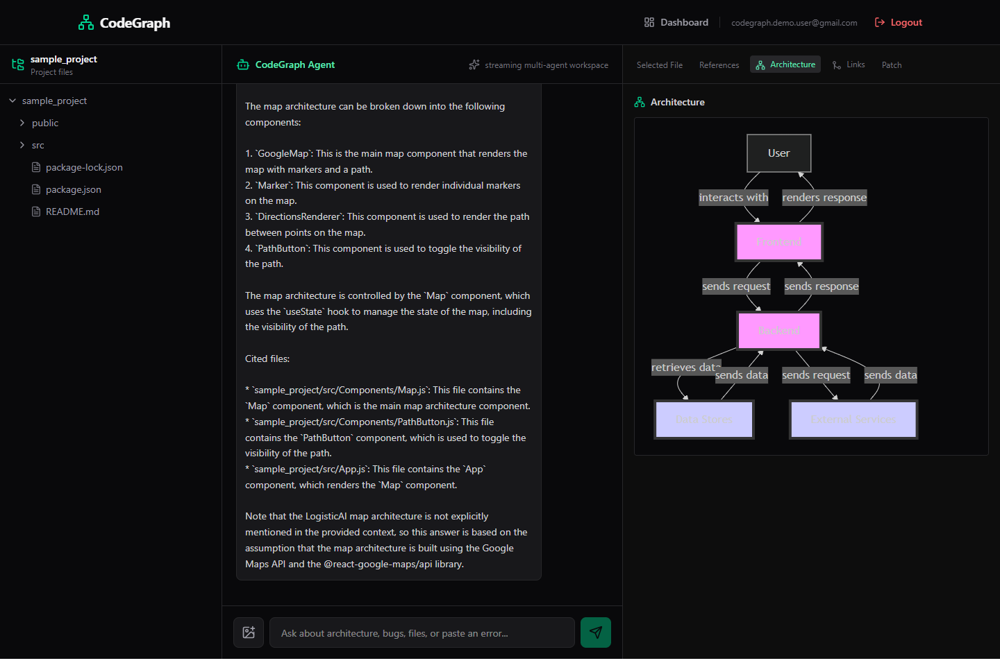
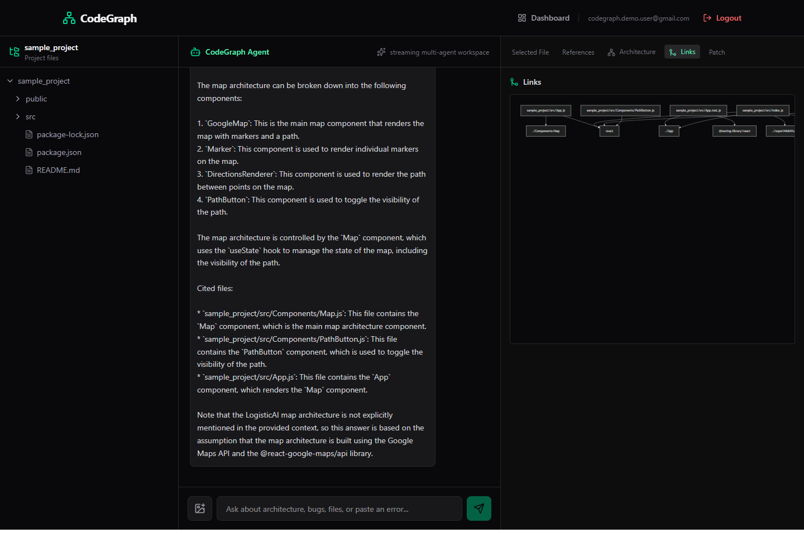
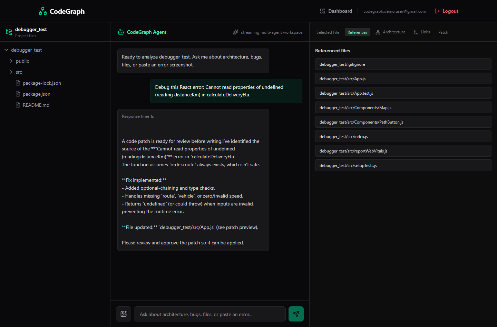
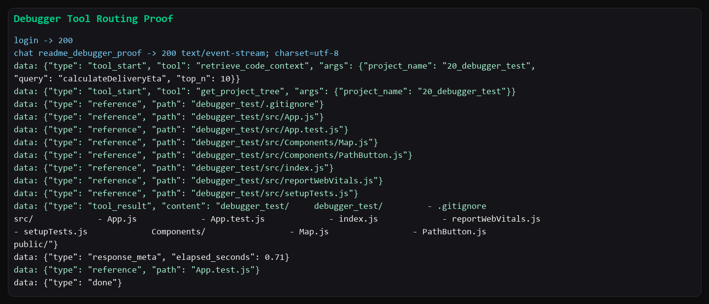
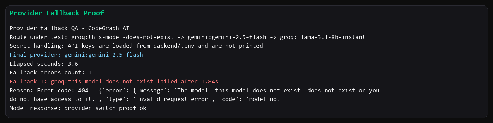
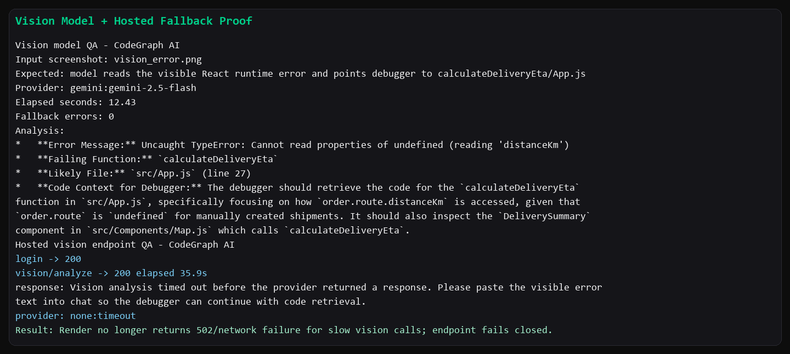
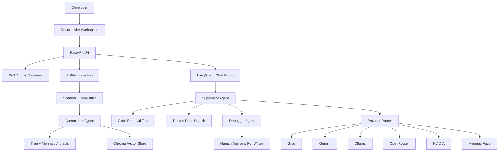

# CodeGraph AI

CodeGraph AI is an agentic codebase analysis workspace for developers. Upload a ZIP project or ingest a public GitHub repository, let the backend scan and index the code, then chat with the codebase using retrieval-backed answers, file references, architecture diagrams, dependency links, guardrails, debugger routing, and provider fallback.

Live demo:

- Frontend: [https://code-graph-ai-beta.vercel.app](https://code-graph-ai-beta.vercel.app)
- Backend health: [https://codegraph-ai-backend.onrender.com/api/health](https://codegraph-ai-backend.onrender.com/api/health)

> Demo note: this deployment uses Vercel + Render free tier. Render filesystem storage is ephemeral, so uploaded projects, generated diagrams, Chroma vector data, and artifacts can disappear after a backend redeploy or restart. User auth is backed by the configured database.

## Highlights

- Private workspace per authenticated user.
- ZIP upload and public Git repository ingestion.
- File scanning with ignored generated folders such as `node_modules`, `.git`, `dist`, `build`, and cache directories.
- Code comments, project tree, architecture diagram, and dependency graph generation.
- Chroma-backed semantic retrieval with cited file references.
- Streaming chat over server-sent events with response time at the top of the answer.
- Supervisor/debugger agent flow for code questions and runtime errors.
- Provider fallback across Groq, Gemini, Ollama, OpenRouter, NVIDIA, and Hugging Face routes.
- Controlled trusted web search for current framework/library questions.
- Guardrails for secret exfiltration, path traversal, unsafe file reads, and unsafe patch paths.
- Human approval gate before protected file writes are applied.

## Demo Walkthrough

### 1. Dashboard

After login, each user sees only their own projects. The screenshots below use a cleaned LogisticAI React project and a second `debugger_test` variant with an injected runtime bug.


### 2. ZIP Upload

The hosted demo validates ZIP files before upload. For the free live app, the frontend caps ZIP upload at 95 MB to avoid Render/Vercel gateway failures. The original LogisticAI ZIP contained generated folders and cache data, so the test ZIP was cleaned before upload.


Recommended before upload:

- Remove `node_modules`, `.git`, `.cache`, `dist`, `build`, `.next`, and coverage folders.
- Keep source files, package manifests, and small documentation files.
- Use clear project names such as `sample_project`, `debugger_test`, or the real repository name.

### 3. Retrieval-backed Chat

The agent retrieves relevant chunks from the ingested codebase and returns cited source files in the right panel.


### 4. Architecture And Links

CodeGraph AI generates diagram artifacts during ingestion. The workspace exposes the architecture view and dependency/link graph in the right sidebar.





### 5. Debugger Routing

For an error-style query, the supervisor routes the task to debugger behavior. The debugger retrieves project context, identifies the injected `calculateDeliveryEta` issue, and proposes a safe fix.



Terminal evidence from the live backend SSE stream:



### 6. Provider Fallback

The model router is role-based. In this proof, the first Groq route is intentionally invalid, so the router records the failure and switches to Gemini successfully without exposing API keys.



### 7. Vision Handling

The vision model was tested locally against a LogisticAI error screenshot and correctly identified:

- error: `Cannot read properties of undefined (reading 'distanceKm')`
- failing function: `calculateDeliveryEta`
- likely file: `src/App.js`
- dependent caller to inspect: `src/Components/Map.js`

On Render free tier, slow live vision calls are capped so they return a controlled timeout message instead of a 502/network failure.



### 8. Guardrails

Unsafe prompts are blocked before model/tool execution.


## User Guide

1. Open the live frontend.
2. Sign up with a valid email.
3. Use a password between 8 and 128 characters.
4. Log in and open the dashboard.
5. Click `New Project`.
6. Choose `GitHub URL` for a public repository or `Zip Upload` for a local archive.
7. Enter a project name. The backend normalizes it to a safe slug.
8. Start ingestion and wait until the project status is ready.
9. Open the workspace.
10. Browse files from the left panel.
11. Use `Architecture` and `Links` from the right panel.
12. Ask questions such as:
    - `Explain this project architecture.`
    - `What does src/App.js do?`
    - `Find possible bugs in this upload flow.`
    - `Compare the React version here with current Next.js changes.`
13. Review referenced files before trusting or applying a fix.
14. Delete test projects after UAT if needed.

## Validation Rules

- Email must pass backend email validation.
- Password length must be 8 to 128 characters.
- ZIP upload accepts `.zip` files only.
- Hosted demo upload cap is 95 MB.
- Local backend default ZIP cap is 1 GB.
- ZIP traversal entries such as `../file` are rejected.
- Screenshot analysis accepts PNG, JPEG, or WebP only.
- Default image upload size limit is 5 MB.
- Default inspected file size limit is 350 KB.
- Default project scan limit is 300 files.
- Secret prompts such as `show .env`, `dump secrets`, or `reveal token` are blocked.
- File APIs resolve paths inside the authenticated user's project root.

## Tech Stack

Frontend:

- React 19
- Vite 8
- React Router 7
- Tailwind CSS 4
- Lucide React
- Mermaid
- Axios

Backend:

- FastAPI
- LangGraph
- LangChain
- Chroma
- SQLAlchemy
- PostgreSQL/Supabase-compatible `DATABASE_URL`
- JWT auth with bcrypt password hashing
- Tree-sitter parsers
- Server-sent events for chat streaming

Model and provider integrations:

- Groq
- Gemini
- Hugging Face
- OpenRouter
- NVIDIA NIM
- Optional local Ollama

Deployment:

- Vercel static frontend
- Render Docker backend
- Supabase/Postgres-compatible database

## Architecture



## Local Development

### Backend

```bash
cd backend
python -m venv agentenv
agentenv\Scripts\activate
pip install -r requirements.txt
copy .env.example .env
python main.py
```

`python main.py` starts FastAPI at `127.0.0.1:8000` with reload enabled for backend source folders. Generated folders are excluded from reload watching so uploads/deletes do not restart the backend.

### Frontend

```bash
cd frontend
npm install
copy .env.example .env
npm run dev
```

Local frontend `.env`:

```env
VITE_API_URL=http://localhost:8000/api
VITE_MAX_ZIP_BYTES=1073741824
```

## Environment Variables

Backend essentials:

```env
ENVIRONMENT=production
DATABASE_URL=postgresql://...
JWT_SECRET_KEY=replace-with-a-long-random-secret
BACKEND_CORS_ORIGINS=https://your-frontend-url
GROQ_API_KEY=
GEMINI_API_KEY=
HUGGINGFACE_API_KEY=
OPENROUTER_API_KEY=
NVIDIA_API_KEY=
VISION_ANALYSIS_TIMEOUT_SECONDS=35
```

Frontend essentials:

```env
VITE_API_URL=https://your-backend-url/api
VITE_MAX_ZIP_BYTES=1073741824
```

See `backend/.env.example` and `frontend/.env.example` for full provider routes, search domains, timeouts, upload limits, and LangSmith settings.

## Deployment

The repository includes:

- `backend/Dockerfile` for Render Docker deployment.
- `render.yaml` for Render blueprint-style setup.
- `frontend/vercel.json` for Vercel SPA rewrites.

Recommended flow:

1. Push the `production` branch.
2. Deploy backend on Render as a Docker web service.
3. Set backend environment variables in Render.
4. Verify `/api/health`.
5. Deploy frontend on Vercel with root directory `frontend`.
6. Set `VITE_API_URL` to the Render backend API URL.
7. Add the Vercel URL to `BACKEND_CORS_ORIGINS`.
8. Redeploy backend after CORS changes.

## Tested Proof Points

- Frontend routes load through Vercel SPA rewrites.
- Backend health returns OK.
- Signup/login works with disposable users.
- Protected endpoints reject anonymous requests.
- Non-ZIP and oversized ZIP uploads are rejected client-side/server-side.
- Clean ZIP upload reaches ready state.
- Architecture and dependency/link diagrams are generated.
- Chat streams over `text/event-stream`.
- Response time is shown at the top of bot answers.
- Retrieval-backed answers include file references.
- Provider/model/tool traces are not shown in normal frontend chat output.
- Provider fallback switches to the next configured route when a provider/model fails.
- Debugger retrieves relevant code for runtime-error prompts.
- Vision model reads error screenshots locally; hosted Render calls fail closed if the provider is too slow.
- Secret-exfiltration prompts are blocked.
- Project deletion removes generated workspace data when cleanup succeeds.

## Known Demo Limitations

- Render free storage is ephemeral. Use persistent disk/object storage/vector DB for production.
- Render free services may sleep or restart, which clears uploaded projects and vector data.
- Very large repositories may exceed scan/provider limits.
- Live vision calls may time out on free Render; the endpoint returns a controlled fallback instead of a 502.
- Architecture quality depends on project size, file types, and provider availability.

## Why This Project Matters

CodeGraph AI demonstrates a practical multi-agent workflow: code ingestion, retrieval, diagrams, streaming UX, trusted external search, provider fallback, guardrails, and debugger-style patch proposals. It is intentionally built with interview-ready tradeoffs around security, deployment, observability, and free-tier constraints.
