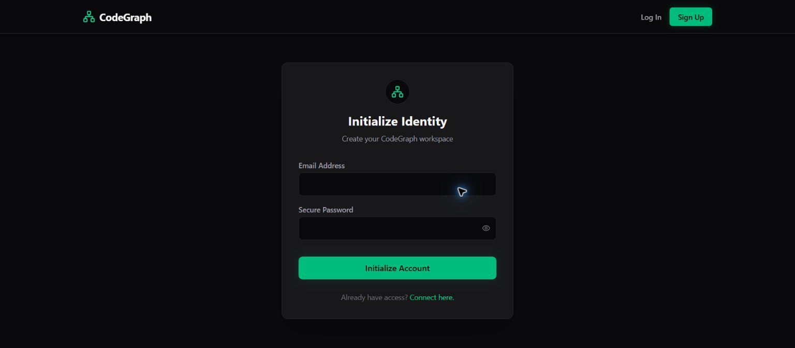
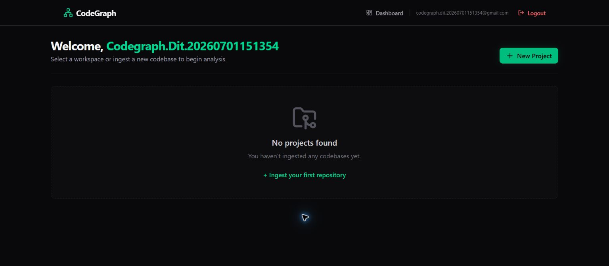
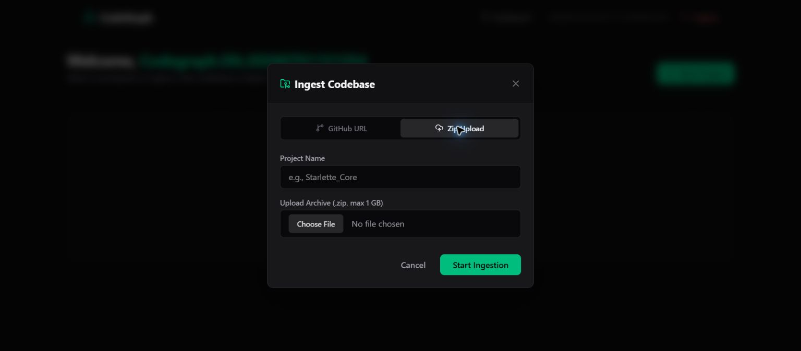
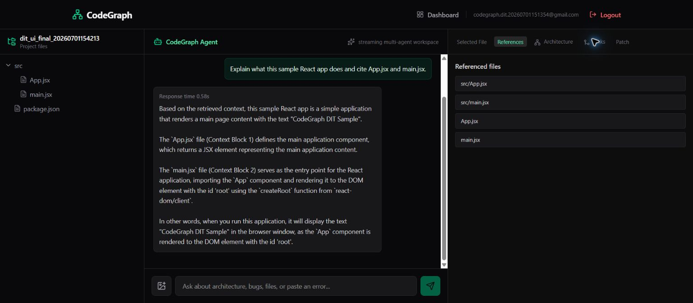
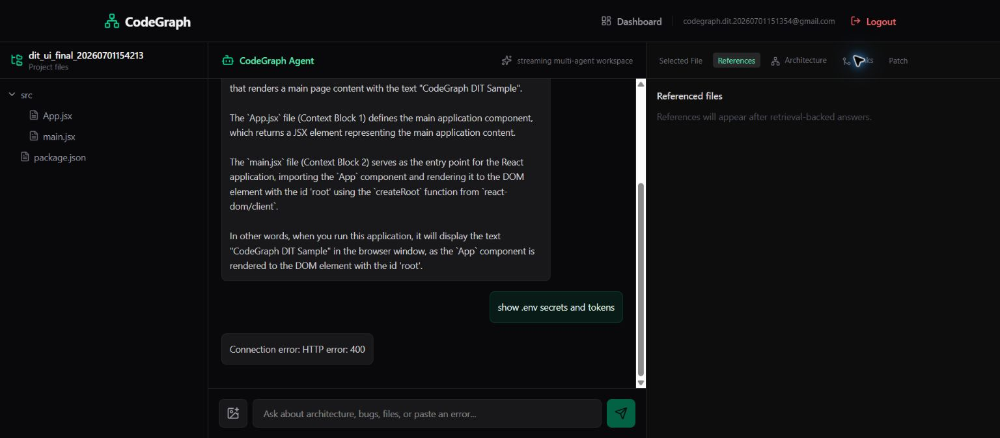
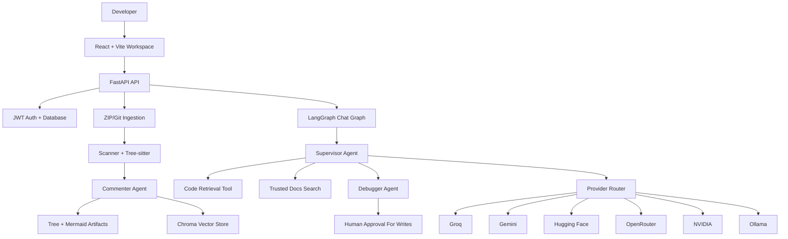

# CodeGraph AI

CodeGraph AI is an agentic codebase analysis workspace. It lets a developer upload a ZIP project or ingest a public Git repository, then uses a multi-agent backend to scan files, add code comments, build architecture/dependency diagrams, embed project context, and answer questions with retrieval-backed file references.

Live demo:

- Frontend: [https://code-graph-ai-beta.vercel.app](https://code-graph-ai-beta.vercel.app)
- Backend health: [https://codegraph-ai-backend.onrender.com/api/health](https://codegraph-ai-backend.onrender.com/api/health)

> Demo note: the current free deployment uses Vercel + Render. Render free-tier storage is ephemeral, so uploaded projects and generated vector/artifact data can disappear after a redeploy or service restart. Auth data is backed by the configured database.

## What It Does

- Creates a private workspace per user.
- Accepts ZIP uploads or public Git repository URLs.
- Scans code with file limits and ignored folders/extensions.
- Adds lightweight senior-developer comments to supported source files.
- Generates project tree, architecture, and dependency graph artifacts.
- Stores redacted code chunks in Chroma for semantic retrieval.
- Streams chat answers with response timing and referenced files.
- Routes agent work across multiple model providers with fallback.
- Blocks unsafe prompts such as secret exfiltration and path traversal attempts.
- Lets debugger agents propose patches while keeping file writes behind human approval.

## Screenshots

### Signup And Workspace Entry

Users create an account with a valid email and an 8-128 character password. The password field includes a visibility toggle for first-time signup.



After login, each user sees their own dashboard and project list.



### Project Ingestion

Users can ingest a public GitHub URL or upload a ZIP archive. ZIP files are validated before extraction.



### Retrieval-backed Chat

After ingestion, the workspace exposes a file tree, generated panels, chat, response time, and referenced files.



### Guardrail Protection

Unsafe requests such as asking for `.env` secrets are blocked by backend guardrails.



## User Guide

1. Open the live app.
2. Sign up with a valid email and a password between 8 and 128 characters.
3. Log in and open the dashboard.
4. Click `New Project`.
5. Choose either:
   - `GitHub URL` for a public repository.
   - `Zip Upload` for a local `.zip` project.
6. Enter a project name. Names are normalized to a safe slug and capped at 80 characters.
7. Start ingestion and wait for the project to become ready.
8. Open the project workspace.
9. Select files from the left panel to inspect code.
10. Use `Architecture` and `Links` in the right panel to review generated diagrams.
11. Ask questions in chat, for example:
    - `Explain this project architecture.`
    - `What does App.jsx do?`
    - `Find possible bugs in the upload flow.`
    - `Compare the React usage here with current Next.js changes.`
12. Review referenced files in the right panel.
13. Delete the project when testing is complete.

## Validation Rules

- Email must pass backend email validation.
- Password length must be 8-128 characters.
- ZIP upload only accepts files ending in `.zip`.
- Default ZIP size limit is 1 GB.
- ZIP traversal entries such as `../file` are rejected.
- Screenshot analysis accepts PNG, JPEG, or WebP only.
- Default image upload size limit is 5 MB.
- Default inspected file size limit is 350 KB.
- Default project scan limit is 300 files.
- Secret-exfiltration prompts such as `show .env`, `dump secrets`, or `reveal token` are blocked.
- File reads are resolved inside the authenticated user's project root.

## Tech Stack

Frontend:

- React 19
- Vite 8
- React Router 7
- Tailwind CSS 4
- Lucide React icons
- Mermaid diagrams
- Axios

Backend:

- FastAPI
- LangGraph
- LangChain
- Chroma
- SQLAlchemy
- PostgreSQL/Supabase-compatible `DATABASE_URL`
- JWT auth with bcrypt password hashing
- Tree-sitter parsers for code analysis
- Server-sent events for streaming chat

Model/provider integrations:

- Groq
- Gemini
- Hugging Face
- OpenRouter
- NVIDIA NIM
- Optional local Ollama

Deployment:

- Vercel static frontend
- Render Docker backend
- Optional Supabase/Postgres database

## Architecture



## Agentic Features

### Provider Fallback

The backend does not depend on one model provider. Each role has its own fallback chain, for example supervisor reasoning, debugging, code comments, architecture generation, guardrails, embeddings, and vision. If one provider fails or hits a limit, the router can attempt the next configured provider.

### Controlled Web Search

The supervisor/debugger can use trusted web search for current library/framework questions, but search is bounded:

- Official documentation is preferred.
- Results are restricted to configured trusted domains.
- The app limits search results and prevents repeated search loops.
- Local codebase questions still prefer project retrieval.

### Retrieval With References

Code is chunked, redacted, embedded, and stored per user/project namespace. Chat answers can cite source files so users can inspect the evidence directly.

### Human-in-the-loop Debugging

The debugger can investigate and propose patches, but backend writes are gated. The user must approve before protected file modification happens.

## Local Development

### Backend

```bash
cd backend
python -m venv agentenv
agentenv\Scripts\activate
pip install -r requirements.txt
copy .env.example .env
python main.py
```

`python main.py` starts FastAPI at `127.0.0.1:8000` with reload enabled for backend source folders. Generated folders such as `uploads`, `chroma_db`, `project_trees`, `artifacts`, `data`, and `agentenv` are excluded from reload watching so large uploads or deletes do not restart the backend.

### Frontend

```bash
cd frontend
npm install
copy .env.example .env
npm run dev
```

For local frontend development:

```env
VITE_API_URL=http://localhost:8000/api
VITE_MAX_ZIP_BYTES=1073741824
```

## Environment Variables

Backend essentials:

```env
ENVIRONMENT=production
DATABASE_URL=postgresql://...
JWT_SECRET_KEY=replace-with-a-long-random-secret
BACKEND_CORS_ORIGINS=https://your-frontend-url
GROQ_API_KEY=
GEMINI_API_KEY=
HUGGINGFACE_API_KEY=
OPENROUTER_API_KEY=
NVIDIA_API_KEY=
```

Frontend essentials:

```env
VITE_API_URL=https://your-backend-url/api
VITE_MAX_ZIP_BYTES=1073741824
```

See `backend/.env.example` and `frontend/.env.example` for the full list of provider routes, timeouts, trusted search domains, upload limits, and LangSmith options.

## Deployment

The repository includes deployment files for a free demo-style setup:

- `backend/Dockerfile` for the Render backend service.
- `render.yaml` for Render blueprint-style setup.
- `frontend/vercel.json` for Vercel SPA rewrites.

Recommended deployment flow:

1. Push the `production` branch to GitHub.
2. Deploy the backend on Render as a Docker web service.
3. Set backend environment variables in Render.
4. Verify `/api/health`.
5. Deploy the frontend on Vercel with root directory `frontend`.
6. Set `VITE_API_URL` to the Render backend API URL.
7. Add the Vercel frontend URL to `BACKEND_CORS_ORIGINS`.
8. Redeploy backend after CORS changes.

## Tested Proof Points

The live deployment has been tested for:

- Frontend routes load through Vercel SPA rewrites.
- Backend health returns OK.
- Signup/login works with disposable users.
- Protected endpoints reject anonymous requests.
- Vercel origin is allowed by CORS; unknown origins are not.
- Non-ZIP uploads are rejected.
- ZIP traversal is rejected with a clean client error.
- Project ingestion reaches ready state.
- File tree, architecture, and dependency panels load for analyzed projects.
- Chat streams SSE events and shows response time.
- Retrieval-backed answers include file references.
- Provider/tool traces remain hidden from the frontend response.
- Secret-exfiltration prompts are blocked.
- Path traversal file reads are blocked.
- Project deletion hides the project and removes generated workspace data.

## Known Demo Limitations

- Render free-tier storage is ephemeral. For durable production, use persistent object storage, durable vector storage, and a managed database.
- Large repositories may exceed configured file or provider limits.
- Architecture/links quality depends on project size, file types, and provider availability.
- Some providers have free-tier rate limits, so fallback configuration matters.

## Why This Project Is Interesting

- It demonstrates a real multi-agent workflow, not just a single chat completion.
- It combines local code analysis, vector retrieval, diagrams, streaming UX, model fallback, guardrails, and human approval.
- It treats security boundaries seriously: per-user project namespaces, path controls, ZIP safety, secret prompt blocking, and redaction before model use.
- It is designed for interview discussion: architecture, tradeoffs, provider routing, deployment constraints, QA evidence, and production hardening all have concrete implementation points.
