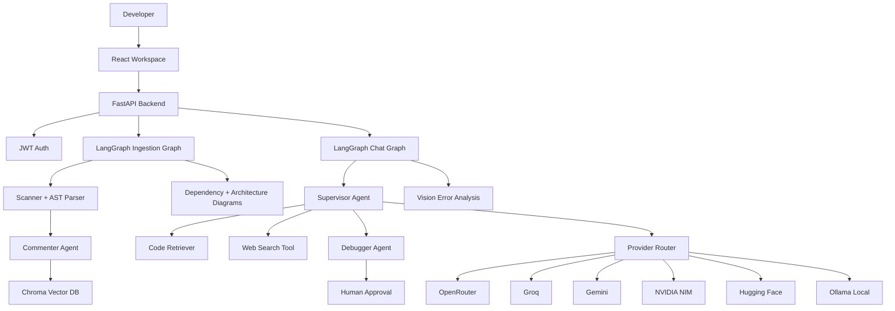

# CodeGraph AI

CodeGraph AI is a multi-agent codebase analyzer for developers. Users log in to a private workspace, upload a zipped project or public Git URL, and the system scans, comments, diagrams, embeds, and chats over that codebase.

## Highlights

- LangGraph ingestion and chat graphs with checkpointed memory.
- Provider fallback across OpenRouter, Groq, Gemini, Hugging Face, NVIDIA, and optional local Ollama.
- Role-based model routing for supervisor reasoning, debugging, code comments, architecture, embeddings, guardrails, and vision.
- Chroma RAG with project isolation, hybrid retrieval, semantic caching, and file citations.
- Human-in-the-loop debugging: agents can propose patches, but writes require approval.
- Streaming SSE events for chunks, response timing, references, approvals, errors, and completion.
- LangSmith-ready observability for graph runs, tool calls, retrieval, guardrails, and provider fallback.

## Architecture



## Local Setup

Backend:

```bash
cd backend
python -m venv agentenv
agentenv\Scripts\activate
pip install -r requirements.txt
copy .env.example .env
python main.py
```

`python main.py` starts FastAPI on `127.0.0.1:8000` with reload enabled for backend source folders and excludes generated folders such as `uploads`, `chroma_db`, `project_trees`, `artifacts`, and `data` from the file watcher. This matters on Windows because uploaded projects can contain large folders such as `node_modules`, and watching those files can restart the backend while a project is being deleted.

Frontend:

```bash
cd frontend
npm install
copy .env.example .env
npm run dev
```

Set at least one chat provider key and one embedding provider key in `backend/.env`. For a fully local run, configure Ollama and pull the models named in `backend/.env.example`.

## Demo Flow

1. Create an account and log in.
2. Upload a small zipped repository or paste a public Git URL.
3. Watch ingestion progress: clone/extract, scan, comment, diagram, embed, ready.
4. Open the workspace.
5. Ask architecture and file-level questions.
6. Review referenced files in the right panel.
7. Upload an error screenshot for vision analysis.
8. Ask for a fix and confirm the debugger requests approval before writing.
9. Inspect LangSmith traces for graph routing, tool calls, retrieval, and provider fallback.

## Deployment

Render deployment files are included:

- Backend Docker image: `backend/Dockerfile`
- Render Blueprint: `render.yaml`
- Deployment guide: `docs/render-deployment.md`

- Frontend target: Render Static Site, Vercel, or another static host.
- Backend target: Render, Railway, Fly-style service, or similar Python host.
- Database target: Supabase Postgres through `DATABASE_URL` for durable demo auth/users.
- Required env vars are documented in `backend/.env.example` and `frontend/.env.example`.

For Render, deploy the backend as a Docker web service and the frontend as a static site. The backend production command must bind to Render's assigned port with `0.0.0.0`; `python main.py` is only for local development.

## Screenshots

Screenshots will be added after deployment:

- Login and personal workspace.
- Project ingestion progress.
- Three-panel workspace.
- Streaming chat with references.
- Error screenshot vision analysis.
- Debugger patch approval.
- LangSmith trace.

## Why These Choices

- LangGraph instead of simple chains: routing, state, checkpointing, and human approval are first-class.
- Chroma instead of plain search: semantic retrieval handles natural language questions across code, symbols, and comments.
- Provider router instead of a single model: free-tier limits change, so fallback is required for a resilient demo.
- SSE instead of one-shot HTTP: users see streamed answers, response timing, references, and approval prompts.
- Human-in-the-loop writes: debugger autonomy is powerful, but production-grade file modification needs approval.
